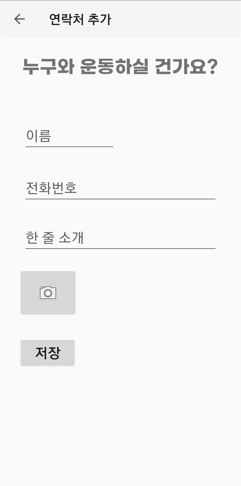

# OWN WAN💪
'기록'이 남지 않으면 하지 않는 현대 사회인들, 오운완은 그런 당신과 함께 운동합니다!

# Teammate
신민영, 김현호

# Intro
</img> 
오 . 운 . 완
# TAB1: 오누운
## Feature
</img> 

1. 연락처 목록 보여주기
2. 연락처 추가 FAB(플로팅 액션 버튼)
3. 상세 페이지 및 메시지 보내기

- RecyclerView를 사용하여 연락처 리스트 구현
- Fab (Floating Action Button)을 사용하여 연락처 추가 기능
   - 새 activity을 열어 연락처 추가 창, 상단에는 뒤로가기 tab 존재
   - 사진은 권한 (externalstorage)을 부여하여 갤러리로부터 가져옴

</img> 

- 문자 기능: 원하는 친구에게 바로 문자메시지 전송이 가능🔥
   - send_SMS 권한을 허용하여 친구에게 문자 메시지를 터치 한 번으로 전송
   - 원하는 내용 작성가능, 위에 머릿말 "[From Own Wan]"

# TAB2: 오운사 

## Feature
1. 갤러리 보여주기
2. TAB3에서 이미지 및 정보 가져오기
3. 갤러리 내 이미지 클릭 시 세부 정보 확인

- RecyclerView와 GridLayout을 사용하여 갤러리 구현
- DatabaseHelper를 이용하여 TAB3에서 작성한 이미지 불러오기
  
   
# TAB3: 오운완

## Feature
1. 한 줄 기록, 몸무게 기록
2. 운동 날짜 기록
3. 카메라 기능을 통한 사진 기록
